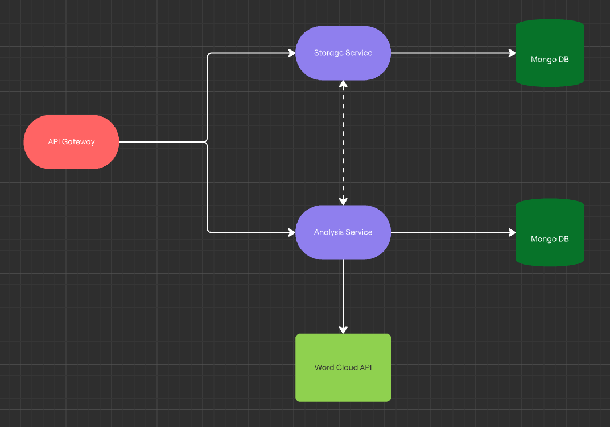

# hse-zeroplug

## Docs

### [Postman](https://www.postman.com/aaalace/workspace/hse-zeroplug/collection/19178316-64364f4d-be57-45e7-89e4-9d750a451123?action=share&creator=19178316)

## Components

The description of each system component can be found in the README file of the corresponding repository

### [API Gateway](https://github.com/hse-zeroplug/api-gateway)
### [Storage Service](https://github.com/hse-zeroplug/storage-service)
### [Analysis Service](https://github.com/hse-zeroplug/analysis-service)

## Architecture

